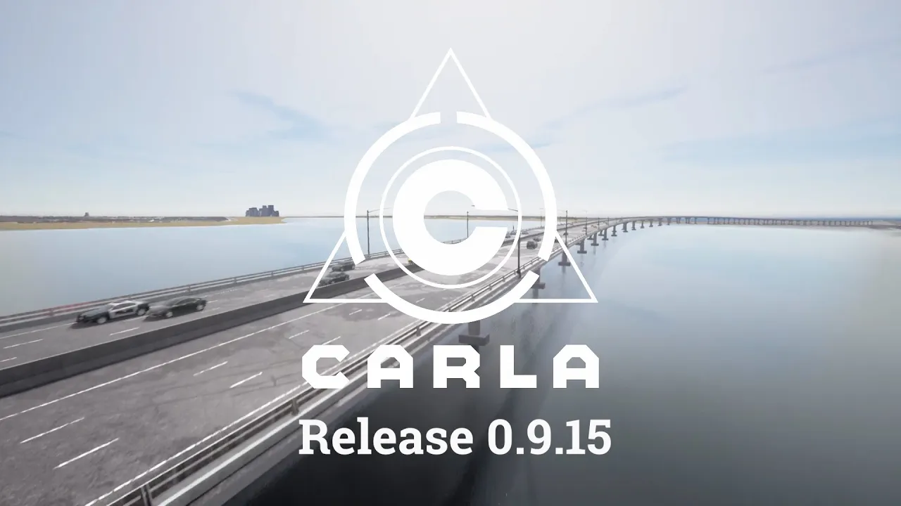
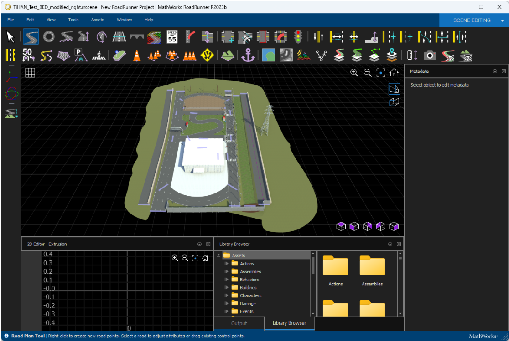

# User Manual for Simulation

Welcome to the comprehensive user manual for the CARLA simulation platform. This document provides detailed instructions and requirements for setting up and using the simulation environment effectively.

## Table of Contents
- [Introduction to Carla](#introduction-to-carla)
- [System Requirements](#system-requirements)
  - [Hardware Requirements](#hardware-requirements)
  - [Software Requirements](#software-requirements)
- [Software Used](#software-used)
  - [Roadrunner](#roadrunner)
  - [Carla Software](#carla-software)
- [Final Code Overview](#final-code-overview)
- [Limitations Observed in Carla](#limitations-observed-in-carla)
- [Further Information](#further-information)

## Introduction to Carla

**CARLA** is an open-source simulation platform designed for developing, training, and validating autonomous driving systems. It provides a rich set of features including digital assets such as urban layouts, buildings, and vehicles, customizable sensor suites, and varied environmental conditions, offering a versatile environment for rigorous testing.

## System Requirements

### Hardware Requirements
- **GPU:** 6GB or more
- **Processor:** Intel i7 or above
- **RAM:** 32GB or more
- **Storage:** 512GB SSD or more

### Software Requirements
- **OS:** Ubuntu 22.04, 20.04, 18.06; Windows 11

## Software Used

### Roadrunner

**Roadrunner** is a powerful tool by Mathworks for creating virtual maps that can be imported into simulators like Carla. It features an interactive editor for personalizing roadways, adding terrains, and props.

#### Installation:
Purchase a license from Mathworks, then follow the updated instructions [here](https://in.mathworks.com/products/roadrunner.html).

#### Roadrunner Workflow:
1. **Creation of Maps:**
   - **Roads Creation:** Utilize the Road Tool in Roadrunner. [Tutorial](https://in.mathworks.com/videos/roadrunner-tutorial-part-4-creating-roads-1687242978029.html)
   - **Terrains and Props:** Use the Surface Tool to create terrains. [Tutorial](https://in.mathworks.com/videos/roadrunner-tutorial-part-7-adding-terrains-and-props-1687243755717.html)
   - **Lane Customization:** Customize lanes using Mathworks Road tools. [Tutorial](https://in.mathworks.com/videos/roadrunner-tutorial-part-5-customizing-lanes-1687243722846.html)
   - **Exporting Maps:** Export the created map to Carla. [Documentation](https://in.mathworks.com/videos/roadrunner-tutorial-part-3-exporting-scenes-to-simulators-1687242968585.html)

### Carla Software
1. **Importing Custom Map:** Follow the steps detailed in the Mathworks document to import the map into Carla.
2. **Scenario Creation:** Manage the map within Carla by setting spawn points and scenarios. Use Carla's autopilot and BasicAgent for simulation.
3. **Installation of Carla .whl file** After Installing Carla, please navigate to the folder where .whl files(../carla/PythonAPI/carla/dist/) and use pip to install carla. Then navigate to PythonAPI folder and copy the Agents folder and paste it in you Python Libraries Folder.

## Final Code Overview
The provided Python script represents an advanced implementation for simulating various automated driving scenarios within the CARLA simulator, integrating several key components such as the CARLA client and world, RGB and depth cameras, and YOLO models for object detection.

## Limitations Observed in Carla
- Limited sensor customization and data latency issues.
- Limited weather representation and scenario scripting.
- Right-hand traffic configurations only.
- Platform support challenges and computational expenses.

## Further Information
For more comprehensive details and step-by-step instructions, please refer to the full [User Manual for Simulation](https://github.com/nineRishav/Solio-S186/blob/baf82bb561ea98ca23ec6243216e9dd03ce4e9b5/Simulation(CARLA)/User%20Manual%20for%20Simulation.pdf).
