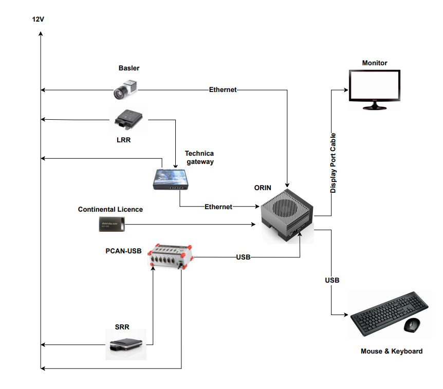
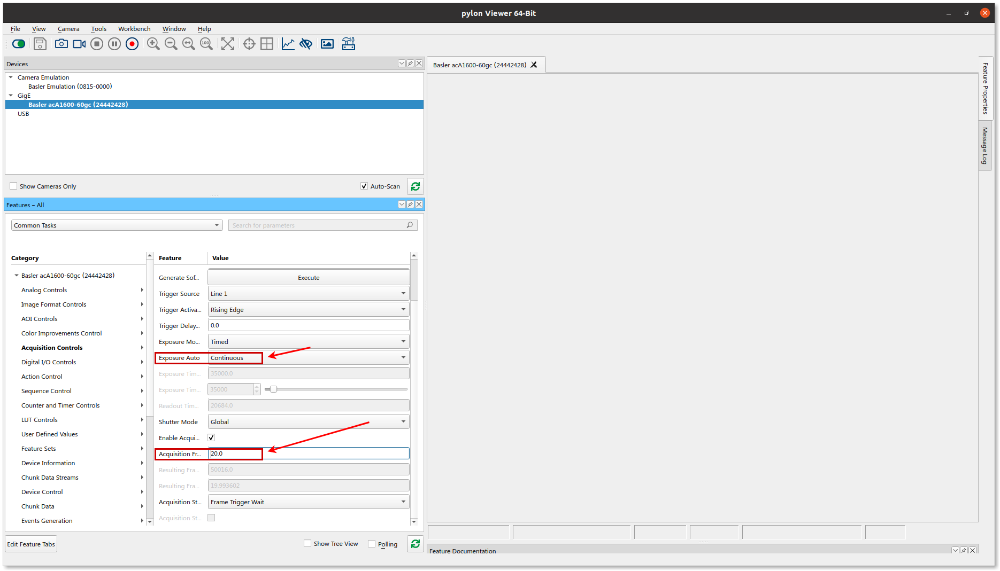
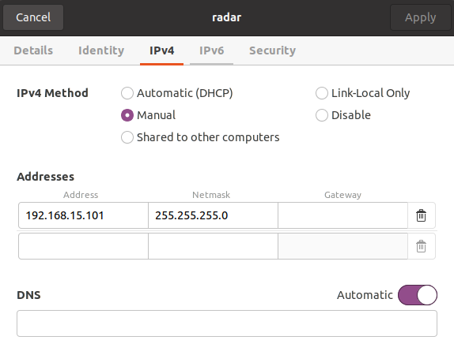
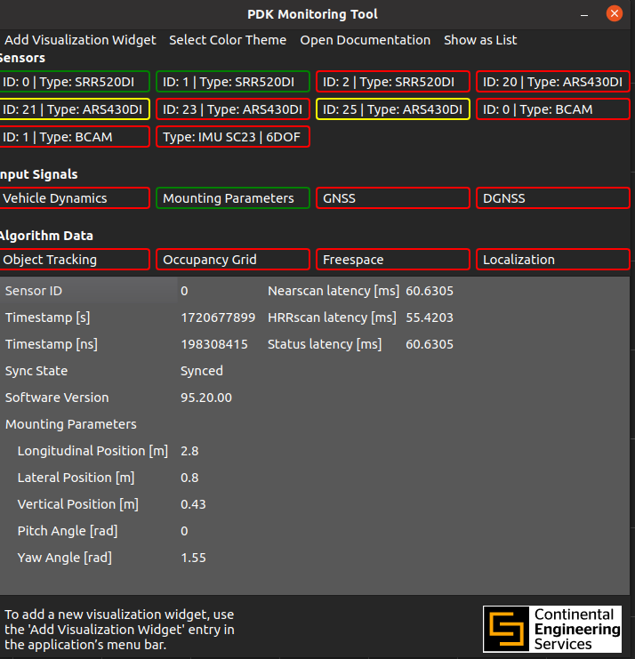
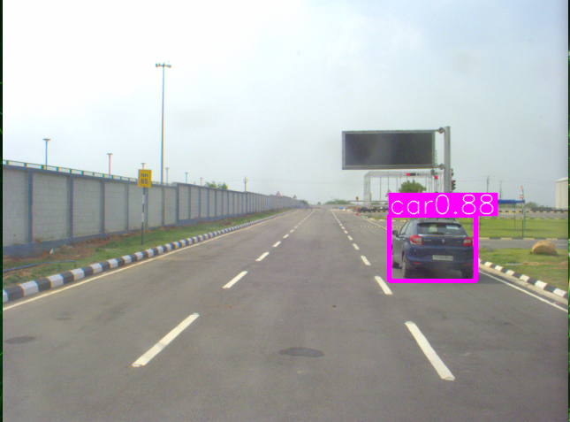
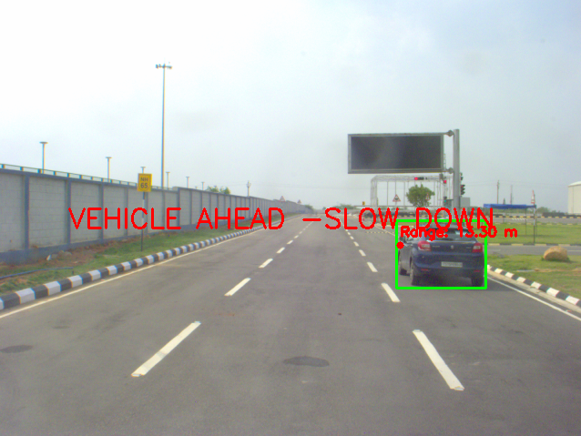
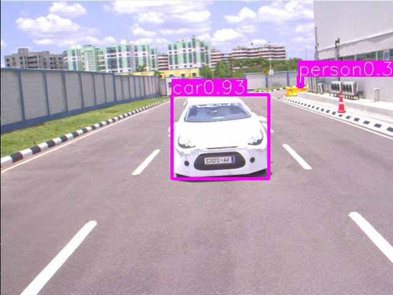
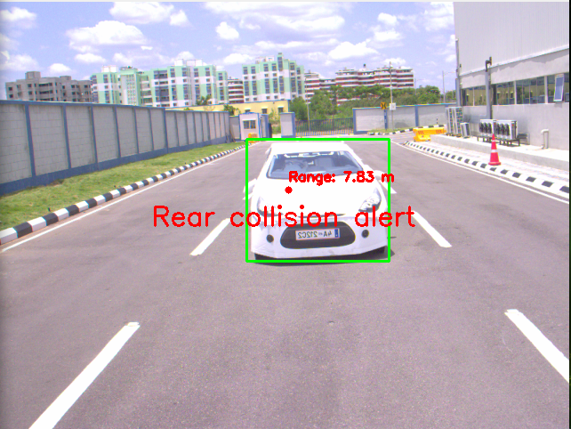

# User Manual for Radar and Camera-based Collision Warning System

### *This instruction manual helps users run the Collision Warning System in SOLIO. The sensors and the connections to ORIN are shown below:*
<div align="center">
     
</div>

##  1. Configuring the Radar and Camera Sensors:

### Camera
1. [Install PylonViewer](https://www.baslerweb.com/en/products/) software based on the camera model to access and control the settings of the Basler camera.
2. The camera model used in the project is **acA1920-40uc**.
3. Set the frame rate and the autofocus mode on the PylonViewer as shown below.
   
    


### Radar
1. For installing Perception Development Kit (PDK) go to
https://drive.google.com/drive/u/2/folders/1pnhmTanhgIpg-5NRwL90d8NqS_hNerf8

Open ```pdk-documentation_0.9.3-321e62e``` folder, then 
Open ```a00371_source.html``` and then from side bar select ```System setup``` and follow the installation steps

2. Put ego vehicle specific parameters in ```pdk_config.json```
   ```bash
    cd /opt/pdk/bin
    sudo gedit pdk_config.json
    ```
For current ego vehicle the file is uploaded in the current repository https://github.com/nineRishav/Solio-S186/blob/master/Solio2-Radar/pdk_config%20(1).json


3. Configure the radar sensor as shown below:
   
    

## 2. Data Acquisition from Sensors


## Enabling GNSS acquisition system
To extract GPS information from the GNSS system, ensure the GNSS sensor is properly configured and connected. Use the following command to initiate the data extraction process. This will start the GNSS node and publish the GPS data for further use.
```bash
sudo chmod 777 /dev/ttyUSB*
```
Before publishing any radar or camera data, ensure that the ROS environment is properly initialized. Run the below command to start the necessary ROS nodes and configurations.
```bash
roslaunch novatel_oem7_driver oem7_tty.launch oem7_tty_name:=/dev/tty/USB0
```
## Enabling Radar Acquisition System
The common steps involved in enabling the radar system are as follows:

1. Enabling the Perception Development Kit (PDK):
    ```bash
    cd /opt/pdk/bin
    ./pdk_start.sh
    ```
   *The Long-range radar ARS430DI will be automatically enabled when the above command is run. To receive data from the Short-range radar, run the below commands.*

2. Set up CAN0 for the left Short-range RADAR and CAN1 for the Right Short-range RADAR mounted on the vehicle. If prompted for a password, provide the system admin password.
    ```bash
    sudo ip link set can0 up type can bitrate 500000 dbitrate 2000000 fd on
    sudo ip link set can1 up type can bitrate 500000 dbitrate 2000000 fd on
    ```

   The following is the reference image for PDK:

    


Once the ROS environment is active, proceed with publishing the sensor data.


## Publishing Radar Data 
1. To publish Front long-range radar:
    ```bash
    cd Downloads/radar_ros/src/conti_radar/_build/devel/lib/conti_radar/
    ./lrr_front_obj
    ```
2. To publish Rear long-range radar:
    ```bash
    cd Downloads/radar_ros/src/conti_radar/_build/devel/lib/conti_radar/To run the vehicle navigation command, ensure all sensors are properly configured and data is being published from both RADAR and camera systems. Integrate the sensor commands to facilitate real-time navigation adjustments. Execute the integrated vehicle navigation script as shown below:
    ./lrr_rear_obj
    ```
3. To publish Left short-range radar:
    ```bash
    cd Downloads/radar_ros/src/conti_radar/_build/devel/lib/conti_radar/
    ./srr_left_obj
    ```
4. To publish Right short-range radar:
    ```bash
    cd Downloads/radar_ros/src/conti_radar/_build/devel/lib/conti_radar/
    ./srr_right_obj
    ```

#### Speed Adjustment Algorithm

The algorithm ensures the ego vehicle adjusts its speed based on the movement of an obstacle vehicle in an adjacent lane. It operates based on distances between the obstacle and ego vehicles. The ego vehicle's speed is reduced when an obstacle vehicle crosses into its lane and remains unchanged when the obstacle stays in its own lane. The code executes commands to adjust the vehicle's speed appropriately when a vehicle cuts in or out in either direction.

### Commands
- **STOP**
  - Reduces the vehicle's speed to zero.
- **slowdown**
  - Reduces the vehicle's speed to half.
- **go**
  - Maintains the vehicle's current speed.

The following code snippet demonstrates how the filtering algorithm operates and publishes commands based on the obstacle vehicle's actions:

```bash
cd Downloads/radar_ros/src/conti_radar/src
python3 srr_right_updated.py
#open an other terminal
cd Downloads/radar_ros/src/conti_radar/src
python3 srr_left_updated.py
```

### Steps
1) Follow the steps based on the type of warning:
   - [Front](#to-perform-forward-collision-warning-system)
   - [Rear](#to-perform-rear-collision-warning-system)

## To perform Forward Collision Warning System
1. Run the Python file [publishing front camera data](https://github.com/SamukthaV/Solio1_RadCam_fusion/blob/main/Collision%20warning%20based%20on%20Sensor%20fusion/FCWS%20%2B%20cut-in%20%2B%20cut-out/front_cam_pub.py)
```bashTo run the vehicle navigation command, ensure all sensors are properly configured and data is being published from both RADAR and camera systems. Integrate the sensor commands to facilitate real-time navigation adjustments. Execute the integrated vehicle navigation script as shown below:
source fusion/bin/activate
python3 front_cam_pub.py
```
 
2. Source the radar functions by running the following command

```bash
source /home/orin/Downloads/radar_ros/src/conti_radar/_build/devel/setup.bash
```
3.  Run the Python file for 
[fusing radar and camera data](https://github.com/SamukthaV/Solio1_RadCam_fusion/blob/main/Collision%20warning%20based%20on%20Sensor%20fusion/FCWS%20%2B%20cut-in%20%2B%20cut-out/front_radcam_fusion.py)

```bash
source fusion/bin/activate
python3 front_radcam_fusion.py
```
 


## To perform Rear Collision Warning System
1. Run the Python file [publishing rear camera data](https://github.com/SamukthaV/Solio1_RadCam_fusion/blob/main/Collision%20warning%20based%20on%20Sensor%20fusion/RCWS/Rear_cam_pub_.py)
```bash
source fusion/bin/activate
python3 Rear_cam_pub.py
```
 

3. Source the radar functions by running the following command
```bash
source /home/orin/Downloads/radar_ros/src/conti_radar/_build/devel/setup.bash
```

4.  Run the python file [fusing rear radar and camera data](https://github.com/SamukthaV/Solio1_RadCam_fusion/blob/main/Collision%20warning%20based%20on%20Sensor%20fusion/RCWS/Rear_radcam_fusion.py)
```bash
source fusion/bin/activate
python3 Rear_radcam_fusion.py
```
 

6. To integrate all the commands from SRR of both the sides and LRR of front and rear [integrated vehicle commands](https://github.com/SamukthaV/Solio1_RadCam_fusion/blob/main/Collision%20warning%20based%20on%20Sensor%20fusion/FCWS%20%2B%20cut-in%20%2B%20cut-out/integrate%20sensor%20commands.py)
```bash
python3 integrate_sensor_commands.py
```
##  3. Vehicle navigation
To run the vehicle navigation command, ensure all sensors are properly configured, and data is published from RADAR and camera systems. Integrate the sensor commands to facilitate real-time navigation adjustments. Execute the integrated vehicle navigation script as shown below.
```bash
python3 navigation_code.py
```

